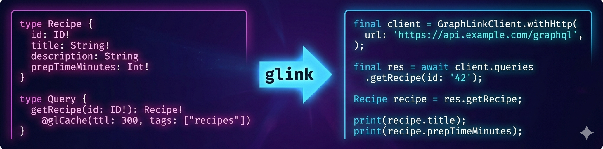

# GraphLink

> Define your GraphQL schema once. Get a fully typed client **and** server scaffold — for Dart, Flutter, Java, TypeScript, and Spring Boot — in milliseconds.

[](https://pub.dev/packages/graphlink)
[](LICENSE)
[](https://github.com/Oualitsen/graphlink/releases/latest)

---

No runtime. No boilerplate. No schema drift.

GraphLink is a CLI tool (`glink`) that reads a `.graphql` file and writes production-ready, idiomatic code for your target language. The generated files have **zero dependency on GraphLink itself** — delete it tomorrow, everything still compiles.

---

## Why GraphLink?

**No generics at the Java call site.**
Every other Java GraphQL client makes you write `TypeReference<GraphQLResponse<Map<String,Object>>>`. GraphLink generates fully-resolved return types:

```java
// Other clients
GraphQLResponse<Map<String, Object>> res = client.query(QUERY_STRING, vars, new TypeReference<>() {});
Vehicle v = objectMapper.convertValue(res.getData().get("getVehicle"), Vehicle.class);

// GraphLink
GetVehicleResponse res = client.queries.getVehicle("42");
System.out.println(res.getGetVehicle().getBrand());
```

**Cache control belongs in your schema.**
Declare caching once with `@glCache` and `@glCacheInvalidate` — the generated client handles TTL, tag-based invalidation, partial query caching, and offline fallback automatically.

**Only what the server needs.**
GraphLink generates minimal, precise query strings. No full-schema dumps that break Spring Boot's strict GraphQL validation.

**Inline error handling.**
Annotate any query or mutation with `@glCaptureErrors` (or set `captureErrors: true` globally) and the generated method returns a `FullResponse` with `data` and `errors` side by side — no try/catch required. Works in Dart, Java, and TypeScript.

**Single source of truth.**
One `.graphql` file drives the Dart client, the Java client, and the Spring Boot or Express/Apollo server — controllers/resolvers plus service interfaces. Add a field once, regenerate, and every end stays in sync.

---

## Supported targets

| Target | Status |
|---|---|
| Dart client | Stable |
| Flutter client (UI widget generation) | Stable |
| Java client | Stable |
| Spring Boot server | Stable |
| TypeScript client | Stable |
| Kotlin client | Stable |
| Express / Apollo (Node.js) | Stable |

---

## Installation

### Recommended — `glink` CLI (fastest)

The CLI compiles to a native binary — no Dart VM overhead, regenerates in milliseconds even on large schemas.

```bash
# macOS (ARM)
curl -fsSL https://github.com/Oualitsen/graphlink/releases/latest/download/glink-macos-arm64 -o glink
chmod +x glink && sudo mv glink /usr/local/bin/glink

# Linux (x64)
curl -fsSL https://github.com/Oualitsen/graphlink/releases/latest/download/glink-linux-x64 -o glink
chmod +x glink && sudo mv glink /usr/local/bin/glink
```

Also available: `glink-macos-x64`, `glink-linux-arm64`, `glink-windows-x64.exe`
→ [All releases](https://github.com/Oualitsen/graphlink/releases/latest)

### Alternative — Dart / Flutter package

```bash
flutter pub add --dev graphlink
# or
dart pub add --dev graphlink
```

---

## Quick Start

### 1. Write your schema

```graphql
type Vehicle {
  id: ID!
  brand: String!
  model: String!
  year: Int!
  fuelType: FuelType!
}

enum FuelType { GASOLINE DIESEL ELECTRIC HYBRID }

input AddVehicleInput {
  brand: String!
  model: String!
  year: Int!
  fuelType: FuelType!
}

type Query {
  getVehicle(id: ID!): Vehicle!    @glCache(ttl: "2m", tags: ["vehicles"])
  listVehicles: [Vehicle!]!        @glCache(ttl: "1m", tags: ["vehicles"])
}

type Mutation {
  addVehicle(input: AddVehicleInput!): Vehicle! @glCacheInvalidate(tags: ["vehicles"])
}
```

### 2. Configure

Create a `glink.json` (or `glink.yaml` / `glink.yml`) in your project root:

```json
{
  "schemaPaths": ["schema/*.graphql"],
  "mode": "client",
  "typeMappings": { "ID": "String", "Float": "double", "Int": "int", "Boolean": "bool" },
  "outputDir": "lib/generated",
  "clientConfig": {
    "dart": {
      "packageName": "my_app"
    }
  }
}
```

### 3. Generate

```bash
glink                   # auto-discovers glink.json / glink.yaml / glink.yml
glink -c config.json    # explicit config path
glink -w                # watch mode — regenerate on every save
```

---

## Usage

### Dart / Flutter

```dart
final client = GraphLinkClient.withHttp(
  url: 'http://localhost:8080/graphql',
  wsUrl: 'ws://localhost:8080/graphql',
  tokenProvider: () async => await getAuthToken(),
);

// Query — fully typed, no casting
final res = await client.queries.getVehicle(id: '42');
print(res.getVehicle.brand);    // Toyota
print(res.getVehicle.fuelType); // FuelType.GASOLINE

// Mutation
final added = await client.mutations.addVehicle(
  input: AddVehicleInput(brand: 'Toyota', model: 'Camry', year: 2023, fuelType: FuelType.GASOLINE),
);

// Subscription
client.subscriptions.vehicleAdded().listen((e) => print(e.vehicleAdded.brand));
```

### Java

```java
// One-liner init — Jackson + Java 11 HttpClient auto-configured
GraphLinkClient client = new GraphLinkClient("http://localhost:8080/graphql");

// Query — no generics, no casting
GetVehicleResponse res = client.queries.getVehicle("42");
System.out.println(res.getGetVehicle().getBrand());

// Mutation — builder pattern
client.mutations.addVehicle(
    AddVehicleInput.builder()
        .brand("Toyota").model("Camry").year(2023).fuelType(FuelType.GASOLINE)
        .build()
);

// List
List<Vehicle> vehicles = client.queries.listVehicles().getListVehicles();
```

### TypeScript

```typescript
import { GraphLinkClient } from './generated/client/graph-link-client';
import { GraphLinkFetchAdapter } from './generated/client/graph-link-fetch-adapter';

const adapter = new GraphLinkFetchAdapter('http://localhost:8080/graphql');
const client = new GraphLinkClient(adapter.call.bind(adapter));

// Query — fully typed
const res = await client.queries.getVehicle({ id: '42' });
console.log(res.getVehicle.brand);    // Toyota
console.log(res.getVehicle.fuelType); // FuelType.GASOLINE

// Mutation
await client.mutations.addVehicle({
  input: { brand: 'Toyota', model: 'Camry', year: 2023, fuelType: FuelType.GASOLINE },
});

// Subscription
client.subscriptions.vehicleAdded({
  onData: (e) => console.log(e.vehicleAdded.brand),
});
```

### Spring Boot (server mode)

Set `"mode": "server"` and GraphLink generates controllers, service interfaces, types, inputs, and enums:

```java
// Generated — implement this interface
public interface VehicleService {
    Vehicle getVehicle(String id);
    List<Vehicle> listVehicles();
    Vehicle addVehicle(AddVehicleInput input);
    Flux<Vehicle> vehicleAdded(); // subscriptions use Reactor Flux
}

// Generated — wires directly into Spring GraphQL
@Controller
public class VehicleServiceController {
    @QueryMapping
    public Vehicle getVehicle(@Argument String id) { return vehicleService.getVehicle(id); }
    // ...
}
```

Just implement the service interface — the routing is done.

### Express / Apollo (server mode)

Set `"mode": "server"` with an `"expressApollo"` block under `serverConfig` and GraphLink generates resolvers, typed service interfaces, and a ready-to-run entry point:

```typescript
// Generated — implement this interface
export interface VehicleService {
  getVehicle(id: string): Promise<Vehicle>;
  listVehicles(): Promise<Vehicle[]>;
  addVehicle(input: AddVehicleInput): Promise<Vehicle>;
  vehicleAdded(): AsyncIterable<Vehicle>; // subscriptions use async generators
}

// Generated — wires Express + Apollo Server + graphql-ws together
import { createServer } from './generated/index.js';

const httpServer = await createServer({
  vehicleService: new VehicleServiceImpl(),
});
httpServer.listen(4000);
```

`@glSkipOnServer(batch: true)` fields generate per-request DataLoaders automatically — same N+1-avoidance guarantee as the Spring targets, idiomatic to Node.

---

## Built-in Caching

Cache control lives in the schema, not scattered through your application code.

```graphql
type Query {
  getVehicle(id: ID!): Vehicle!         @glCache(ttl: "2m", tags: ["vehicles"])
  getUserProfile(id: ID!): UserProfile  @glCache(ttl: "1m", staleIfOffline: true)
}

type Mutation {
  addVehicle(input: AddVehicleInput!): Vehicle!  @glCacheInvalidate(tags: ["vehicles"])
  resetData: Boolean!                            @glCacheInvalidate(all: true)
}
```

Cache entries are keyed by operation name + variables — each unique argument combination is cached independently. The generated client handles all of it automatically. Bring your own persistent store by implementing `GraphLinkCacheStore`.

---

## How It Compares

| Feature | GraphLink | ferry (Dart) | Apollo (JS/Kotlin) | Manual |
|---|---|---|---|---|
| Runtime dependency | ✅ None | ❌ Yes | ❌ Yes | ✅ None |
| Sends whole schema per request | ✅ No | ❌ Yes | ⚠️ Partial | ✅ No |
| Generics at Java call site | ✅ No | ➖ N/A | ❌ Yes | ❌ Yes |
| Server-side generation | ✅ Yes | ❌ No | ⚠️ Partial | ❌ Manual |
| Java client | ✅ Yes | ❌ No | ⚠️ Kotlin only | ❌ Manual |
| Cache directives in schema | ✅ Yes | ❌ No | ❌ No | ❌ No |
| Spring Boot controller gen (MVC) | ✅ Yes | ❌ No | ❌ No | ❌ Manual |
| Spring Boot controller gen (WebFlux) | ✅ Yes | ❌ No | ❌ No | ❌ Manual |

---

## Documentation

Full documentation at **[graphlink.dev](https://graphlink.dev/docs/index.html)**

- [Getting Started](https://graphlink.dev/docs/getting-started.html)
- [Dart / Flutter Client](https://graphlink.dev/docs/dart-client.html)
- [Java Client](https://graphlink.dev/docs/java-client.html)
- [TypeScript Client](https://graphlink.dev/docs/typescript-client.html)
- [Spring Boot Server](https://graphlink.dev/docs/spring-server.html)
- [Express / Apollo Server](https://graphlink.dev/docs/express-apollo.html)
- [Caching](https://graphlink.dev/docs/caching.html)
- [Directives Reference](https://graphlink.dev/docs/directives.html)
- [Configuration Reference](https://graphlink.dev/docs/configuration.html)

---

## License

MIT — see [LICENSE](LICENSE).

Issues and contributions welcome at [github.com/Oualitsen/graphlink](https://github.com/Oualitsen/graphlink).
