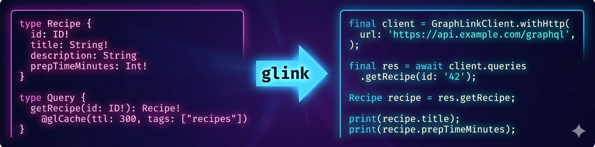

     

# GraphLink

> Define your GraphQL schema once. Get a fully typed client **and** server scaffold — for Dart, Flutter, Java, and Spring Boot — in seconds.

[](https://pub.dev/packages/retrofit_graphql)
[](LICENSE)
[](https://github.com/Oualitsen/graphlink/releases/latest)

---

No runtime. No boilerplate. No schema drift.

GraphLink is a CLI tool (`glink`) that reads a `.graphql` file and writes production-ready, idiomatic code for your target language. The generated files have **zero dependency on GraphLink itself** — delete it tomorrow, everything still compiles.

---

## Why GraphLink?

**No generics at the Java call site.**
Every other Java GraphQL client makes you write `TypeReference<GraphQLResponse<Map<String,Object>>>`. GraphLink generates fully-resolved return types:

```java
// Other clients
GraphQLResponse<Map<String, Object>> res = client.query(QUERY_STRING, vars, new TypeReference<>() {});
Vehicle v = objectMapper.convertValue(res.getData().get("getVehicle"), Vehicle.class);

// GraphLink
GetVehicleResponse res = client.queries.getVehicle("42");
System.out.println(res.getGetVehicle().getBrand());
```

**Cache control belongs in your schema.**
Declare caching once with `@glCache` and `@glCacheInvalidate` — the generated client handles TTL, tag-based invalidation, partial query caching, and offline fallback automatically.

**Only what the server needs.**
GraphLink generates minimal, precise query strings. No full-schema dumps that break Spring Boot's strict GraphQL validation.

**Single source of truth.**
One `.graphql` file drives the Dart client, the Java client, and the Spring Boot controllers + service interfaces. Add a field once, regenerate, and both ends stay in sync.

---

## Supported targets

| Target | Status |
|---|---|
| Dart client | Stable |
| Flutter client | Stable |
| Java client | Stable |
| Spring Boot server | Stable |
| TypeScript client | Stable |
| Express / Node.js | Planned |
| Go, Kotlin | Planned |

---

## Installation

Download the single self-contained binary — no JVM, no package manager required.

```bash
# macOS (ARM)
curl -fsSL https://github.com/Oualitsen/graphlink/releases/latest/download/glink-macos-arm64 -o glink
chmod +x glink && sudo mv glink /usr/local/bin/glink

# Linux (x64)
curl -fsSL https://github.com/Oualitsen/graphlink/releases/latest/download/glink-linux-x64 -o glink
chmod +x glink && sudo mv glink /usr/local/bin/glink
```

Also available: `glink-macos-x64`, `glink-linux-arm64`, `glink-windows-x64.exe`  
→ [All releases](https://github.com/Oualitsen/graphlink/releases/latest)

**Flutter / Dart projects** can also use the Dart package:

```bash
flutter pub add --dev graphlink
# or
pub add --dev graphlink
```

---

## Quick Start

### 1. Write your schema

```graphql
type Vehicle {
  id: ID!
  brand: String!
  model: String!
  year: Int!
  fuelType: FuelType!
}

enum FuelType { GASOLINE DIESEL ELECTRIC HYBRID }

input AddVehicleInput {
  brand: String!
  model: String!
  year: Int!
  fuelType: FuelType!
}

type Query {
  getVehicle(id: ID!): Vehicle!    @glCache(ttl: 120, tags: ["vehicles"])
  listVehicles: [Vehicle!]!        @glCache(ttl: 60,  tags: ["vehicles"])
}

type Mutation {
  addVehicle(input: AddVehicleInput!): Vehicle! @glCacheInvalidate(tags: ["vehicles"])
}
```

### 2. Configure

```json
{
  "schemaPaths": ["schema/*.graphql"],
  "mode": "client",
  "typeMappings": { "ID": "String", "Float": "double", "Int": "int", "Boolean": "bool" },
  "outputDir": "lib/generated",
  "clientConfig": {
    "dart": {
      "packageName": "my_app",
      "generateAllFieldsFragments": true,
      "autoGenerateQueries": true
    }
  }
}
```

### 3. Generate

```bash
glink -c config.json        # once
glink -c config.json -w     # watch mode — regenerate on every save
```

That's it. You get typed classes, a ready-to-use client, JSON serialization, and cache wiring — all generated.

---

## Usage

### Dart / Flutter

```dart
// Initialize — one line with generated adapters
final client = GraphLinkClient.withHttp(
  url: 'http://localhost:8080/graphql',
  wsUrl: 'ws://localhost:8080/graphql',
  tokenProvider: () async => await getAuthToken(), // optional
);

// Query — fully typed, no casting
final res = await client.queries.getVehicle(id: '42');
print(res.getVehicle.brand);    // Toyota
print(res.getVehicle.fuelType); // FuelType.GASOLINE

// Mutation
final added = await client.mutations.addVehicle(
  input: AddVehicleInput(brand: 'Toyota', model: 'Camry', year: 2023, fuelType: FuelType.GASOLINE),
);

// Subscription
client.subscriptions.vehicleAdded().listen((e) => print(e.vehicleAdded.brand));
```

### Java

```java
// One-liner init — Jackson + Java 11 HttpClient auto-configured
GraphLinkClient client = new GraphLinkClient("http://localhost:8080/graphql");

// Query — no generics, no casting
GetVehicleResponse res = client.queries.getVehicle("42");
System.out.println(res.getGetVehicle().getBrand());

// Mutation — builder pattern
client.mutations.addVehicle(
    AddVehicleInput.builder()
        .brand("Toyota").model("Camry").year(2023).fuelType(FuelType.GASOLINE)
        .build()
);

// List
List<Vehicle> vehicles = client.queries.listVehicles().getListVehicles();
```

### Spring Boot (server mode)

Set `"mode": "server"` and GraphLink generates controllers, service interfaces, types, inputs, and enums:

```java
// Generated — implement this interface
public interface VehicleService {
    Vehicle getVehicle(String id);
    List<Vehicle> listVehicles();
    Vehicle addVehicle(AddVehicleInput input);
    Flux<Vehicle> vehicleAdded(); // subscriptions use Reactor Flux
}

// Generated — wires directly into Spring GraphQL
@Controller
public class VehicleServiceController {
    @QueryMapping
    public Vehicle getVehicle(@Argument String id) { return vehicleService.getVehicle(id); }
    // ...
}
```

Just implement the service interface — the routing is done.

---

## Built-in Caching

Cache control lives in the schema, not scattered through your application code.

```graphql
type Query {
  # Cache for 2 minutes, tagged "vehicles"
  getVehicle(id: ID!): Vehicle!  @glCache(ttl: 120, tags: ["vehicles"])

  # Serve stale data when offline instead of throwing
  getUserProfile(id: ID!): UserProfile @glCache(ttl: 60, staleIfOffline: true)
}

type Mutation {
  # Evicts all "vehicles" cache entries on success
  addVehicle(input: AddVehicleInput!): Vehicle! @glCacheInvalidate(tags: ["vehicles"])

  # Wipe everything
  resetData: Boolean! @glCacheInvalidate(all: true)
}
```

Cache entries are keyed by operation name + variables — each unique argument combination is cached independently. The generated client handles all of it automatically. Bring your own persistent store by implementing `GraphLinkCacheStore`.

---

## How It Compares

| Feature | GraphLink | ferry (Dart) | Apollo (JS/Kotlin) | Manual |
|---|---|---|---|---|
| Runtime dependency | None | Yes | Yes | None |
| Sends whole schema per request | No | Yes | Partial | No |
| Generics at Java call site | No | N/A | Yes | Yes |
| Server-side generation | Yes | No | Partial | Manual |
| Java client | Yes | No | Kotlin only | Manual |
| Cache directives in schema | Yes | No | No | No |
| Spring Boot controller gen | Yes | No | No | Manual |

---

## Documentation

Full documentation at **[graphlink.dev](https://graphlink.dev/docs/index.html)**

- [Getting Started](https://graphlink.dev/docs/getting-started.html) — install, first schema, run generator
- [Dart / Flutter Client](https://graphlink.dev/docs/dart-client.html) — adapters, queries, mutations, subscriptions
- [Java Client](https://graphlink.dev/docs/java-client.html) — no-generics API, builder pattern, adapters
- [Spring Boot Server](https://graphlink.dev/docs/spring-server.html) — controllers, service interfaces, subscriptions
- [Caching](https://graphlink.dev/docs/caching.html) — `@glCache`, `@glCacheInvalidate`, partial caching, offline
- [Directives Reference](https://graphlink.dev/docs/directives.html) — all 13 directives with examples
- [Configuration Reference](https://graphlink.dev/docs/configuration.html) — every config key explained

---

## License

MIT — see [LICENSE](LICENSE).

Issues and contributions welcome at [github.com/Oualitsen/graphlink](https://github.com/Oualitsen/graphlink).
